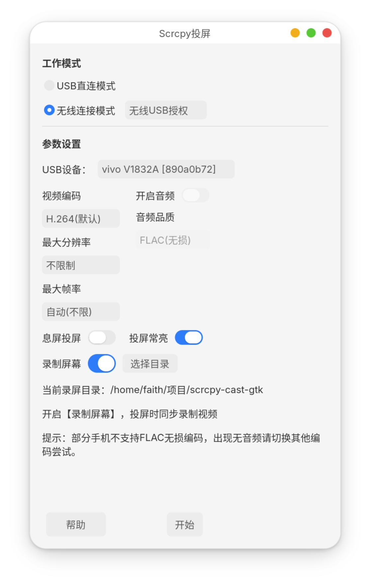
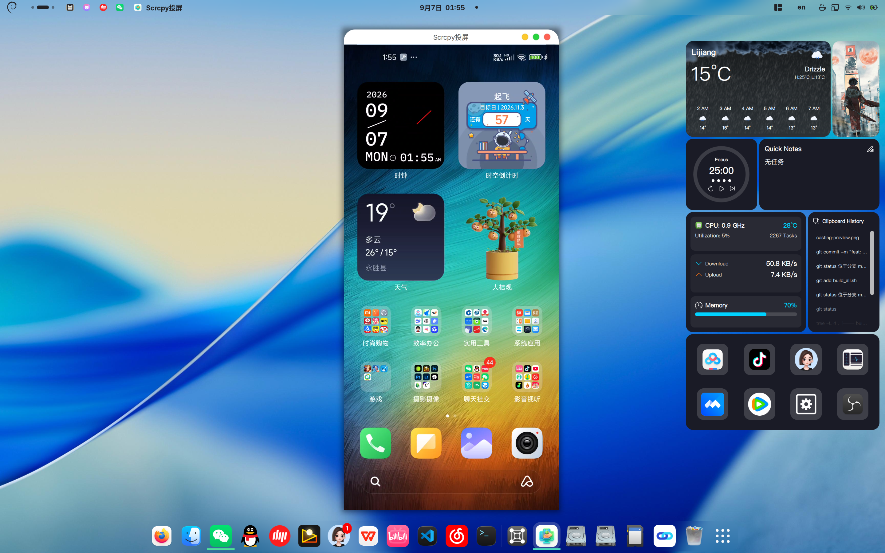

<div align="center">
# scrcpy‑cast‑gtk 📱
> GTK4 GUI frontend for scrcpy — Android screen‑cast tool for Linux

**原生 GTK4 图形界面，封装 scrcpy，在 Debian Linux 上投屏安卓设备**
</div>
## ✨ 项目简介
scrcpy‑cast‑gtk 是 scrcpy 的图形外壳，使用 Python + GTK4 开发，面向 GNOME Wayland / X11 环境。
不用记忆命令行参数，图形界面完成安卓投屏相关操作。
主要功能：
- ADB 设备自动扫描与设备选择
- USB / Wi‑Fi 无线投屏
- 投屏时保持手机常亮
- 音频转发
- 窗口基础控制
- 输出原生 deb 软件包，方便 Debian 系发行版安装部署
投屏效果预览：

## 📋 依赖
### 运行时依赖
- `scrcpy`
- `adb`
- `python3`
- `python3‑gi`
- `gir1.2‑gtk‑4.0`
- `gir1.2‑adw‑1`
### 构建 deb 包依赖
- `dpkg‑buildpackage`
- `debhelper‑compat`
- `dh‑python`
## 🚀 构建与使用
克隆仓库：
```bash
git clone [https://github.com/usbipad/scrcpy](https://github.com/usbipad/scrcpy)‑cast‑gtk.git
cd scrcpy‑cast‑gtk
```

### 使用一键脚本构建 deb

```
chmod +x build_all.sh
./build_all.sh
```

### 使用 dpkg‑buildpackage 构建 deb

```
dpkg-buildpackage -b -uc -us
```

安装：

```
sudo dpkg -i ../scrcpy‑cast‑gtk_1.1.0_all.deb
```

卸载：

```
sudo dpkg -r scrcpy‑cast‑gtk
```

